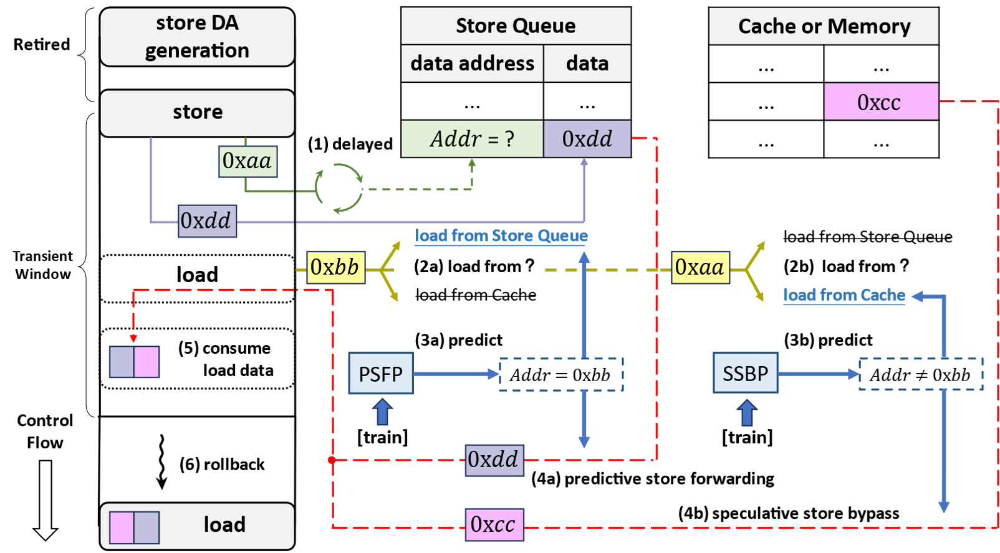
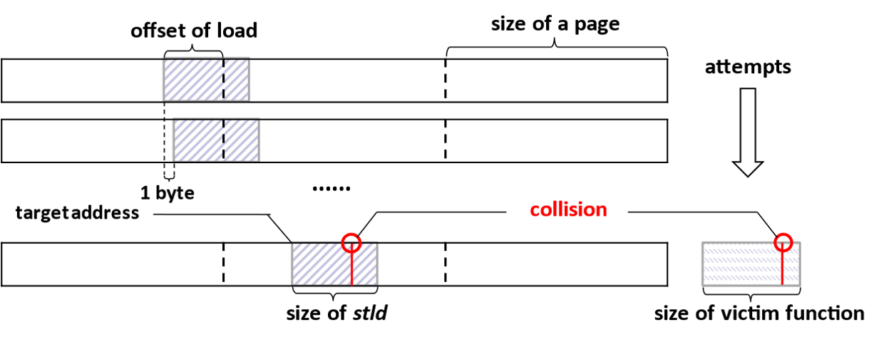

# Out-of-Place Spectre-STL and Spectre-CTL Attacks

## Introduction 

The code in this project demonstrates the transient execution vulnerabilities of two predictors, the Speculative Store Bypass (SSB) predictor and the Predictive Store Forwarding (PSF) predictor in AMD Zen3 Processores. In specific, we propose two innovative attacks targeting these predictors, including an out-of-place variant of Spectre-STL attack based on PSFP and Spectre-CTL attack based on SSBP.

The PoC of the Out-of-Place Spectre-STL attack is in the directory `Spectre-STL-ng`, and the PoC of the Spectre-CTL attack is in the directory `Spectre-CTL`. In specific, the repository is organized as follows:

```
.
├── figures                 -- figures illustrated in README files
├── Spectre-CTL             -- PoC of the Spectre-CTL Attack
│   ├── config.h            -- Some configurable parameters
│   ├── Makefile            -- Compile the PoC via make
│   ├── README.md           
│   └── spectre-ctl.c       -- Source code of the Spectre-CTL Attack
└── Spectre-STL-ng          -- PoC of the out-of-place Spectre-STL Attack
    ├── config.h            -- Some configurable parameters
    ├── Makefile            -- Compile the PoC via make
    ├── README.md           
    └── spectre-stl-ofp.c   -- Source code of the out-of-place Spectre-STL Attack
```

## Quick Start

A C compiler is required to build the PoC. Please install `gcc` and `make` before start.

- To build and run the out-of-place Spectre-STL Attack:

```
cd Spectre-STL-ng
make
./spectre-stl-ofp
```

- To build and run the Spectre-CTL Attack:

```
cd Spectre-CTL
make
./spectre-ctl
```

## Environment

We have tested the PoCs on 4 CPUs with different kernel version, which is shown as follows:

|Processor|Microcode|Kernel|
|:-:|:-:|:-:|
|AMD Ryzen 9 5900X|0xA201205|Linux 5.15.0-76-generic|
|AMD EPYC 7543|0xA001173|Linux 6.1.0-rc4-snp-host-93fa8c5918a4|
|AMD Ryzen 5 5600G|0xA50000D|Linux 5.15.0-76-generic|
|AMD Ryzen 7 7735HS|0xA404102|Linux 5.4.0-153-generic|

The two attacks leak secrets successfully on these CPUs.

## Attack Features

Based on the reverse engineering of SSBP and PSFP, we can train any entries of these predictors to any states and trigger the mispredictions. The process of the transient execution of PSFP and SSBP is shown in Fig 1.

<center> </center>
<center> <b>Fig 1. </b> &nbsp Transient Execution of PSFP and SSBP. </center>

####

As shown in Fig 1, we delay the data address generation of the store by performing time-consuming calculations or loading the data address from memory (1). This allows the predictors to be used to predict whether the load can bypass the store and whether the data of the store can be forwarded to the load before its address is generated. For simplification, assume that the DPA of the store is 0xaa, and the data is 0xdd. The DPA of the load is 0xaa (2a) or 0xbb (2b) in different cases. The memory 0xaa contains the value 0xcc.

By training the predictors, we can trigger a misprediction of PSFP (3a) or SSBP (3b). In the misprediction of PSFP, the DPA of the store is predicted as 0xbb, and a predictive store forwarding is performed (4a). In the misprediction of SSBP, the DPA of the store is predicted as another value that is not equal to 0xbb, and then a speculative store bypass is performed to load the data from the data cache or memory (4b).

Before the data address of the store is generated, the CPU does not stall the following instructions, but continues to consume the incorrectly loaded data (5). Since the CPU will find the misprediction and reissue the load later, the execution is referred to as the transient execution. To observe the loaded data in the transient window, we can use the cache side channel or SSBP itself to recover the data. When the data address of the store is generated, the CPU identifies a misprediction and triggers a rollback to eliminate the effects of the transient execution (6). After the rollback, we recover the data in the transient window by timing the cache access or the execution of the store-load pair.

The results indicate that 0xbb is loaded in the transient window triggered by PSFP, and 0xcc is loaded in the transient window triggered by SSBP. Therefore, both predictors can be misused to trigger the transient execution, during which an unexpected value is loaded and consumed.

To search for the collision, we use the code sliding shown in Fig 2.

<center> </center>
<center> <b>Fig 2. </b> &nbsp Code sliding to find collision for the predictors. </center>

####

The store-load pair in the victim fixes at an address. We obtain the machine code of another store-load pair for priming and probing the PSFP and SSBP, and fill the machine code into a set of contiguous pages.

After that, we execute the store-load pair in the victim space using a well-designed memory access sequence for PSFP and SSBP, and then execute the code using another well-designed memory access sequence.

Finally, we check whether the collision occurs by timing the execution of the candidate prime and probe function. If the execution time matches the SSBP or PSFP state, the collision occurs. Otherwise, the collision does not occur, and we increase the entry address of the candidate prime and probe function by one byte, so that the IPA moves one byte within the page for the next attempt. 

## Defense

To mitigate these new variants of Spectre attacks, we recommend AMD users to activate Speculative Store Bypass Disable (SSBD). While enabling SSBD may incur a performance loss, it effectively stops the attacks because SSBP and PSFP are disabled with SSBD enabld.

## Research Paper

Our research on SSBP and PSFP, including out-of-place Spectre-STL and Spectre-CTL attacks, is presented in paper *Uncovering and Exploiting AMD Speculative
Memory Access Predictors for Fun and Profit*. The paper has been accepted in the 30th International Symposium on High-Performance Computer Architecture (HPCA 2024).