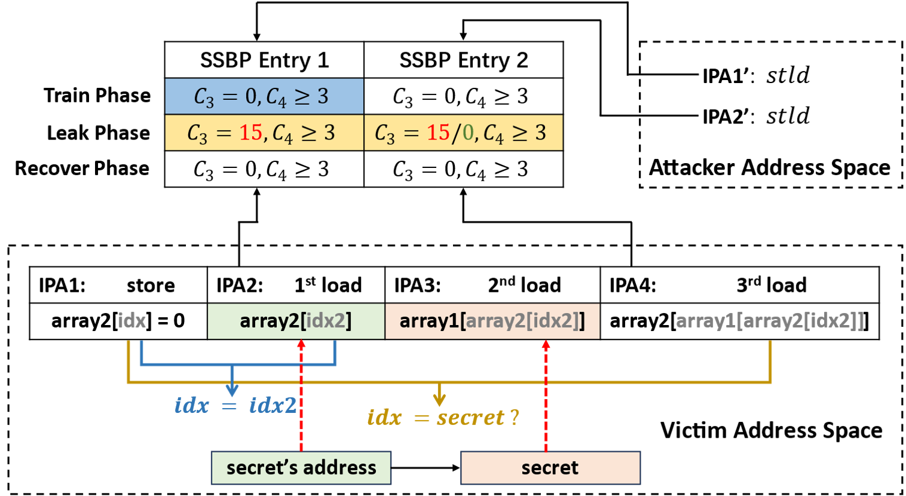

# Spectre-CTL PoC

## Introduction

In this Proof-of-Concept (PoC), we present the utilization of the SSBP to construct a new variant of the Spectre Attack, which we name as Spectre-CTL. Furthermore, we demonstrate the use of the SSBP to transmit a secret byte at a time in the transient window.

Specifically, this PoC reveals that the SSBP can be leveraged in two distinct attack phases within a Spectre attack:

- Triggering a transient window: The SSBP enables the creation of a transient window without relying on the branch predictor or a faulty load, facilitating the execution of a speculative load.
In contrast to Spectre-STL (also known as Spectre V4), where the data for the speculative load is retrieved from an unresolved store, in this case, the data is fetched from the cache.

- Transmitting secrets in a transient window: The SSBP allows for the transmission of secrets within a transient window without requiring the use of a cache side channel, thereby bypassing traditional detection mechanisms.

An interesting aspect of this approach is the use of an out-of-place method to prime or train the SSBP. This method involves utilizing another load instruction to prime the SSBP before triggering the transient window through the load of the victim. This technique allows for effective conditioning of the SSBP, optimizing its behavior for the subsequent speculative execution of the load.

By showcasing these capabilities, this PoC underscores the potential risks posed by the SSBP in enabling sophisticated Spectre attacks that can exploit transient execution.

Considering that SSBP is not well isolated among different processes, between user space and kernel space, and even between host OS and guest OS with SEV-SNP, more powerful and end-to-end attacks are possible to be implemented.

## Build

A C compiler is required. For example, we use gcc 9.4.0 with make 4.2.1. No specific kernel or package dependencies and installations are required. The executable file named `spectre-ctl` can be built through a simple command:

```shell
make
```

## Run

```shell
./spectre-ctl
```

Expected result is as follows:

```
Search offset of prime entry: find offset as 246
Search offset of probe entry: find offset as 3271
Putting 'Leaky SSBP: A noval Spectre-CTL attack!' in memory, address 0x557417b15008
Reading 39 bytes:
Reading at address = 0x557417b15008... Success: 0x4C='L' score=3 
Reading at address = 0x557417b15009... Success: 0x65='e' score=3 
Reading at address = 0x557417b1500a... Success: 0x61='a' score=3 
Reading at address = 0x557417b1500b... Success: 0x6B='k' score=3 
Reading at address = 0x557417b1500c... Success: 0x79='y' score=3 
Reading at address = 0x557417b1500d... Success: 0x20=' ' score=3 
Reading at address = 0x557417b1500e... Success: 0x53='S' score=3 
Reading at address = 0x557417b1500f... Success: 0x53='S' score=3 
Reading at address = 0x557417b15010... Success: 0x42='B' score=3 
Reading at address = 0x557417b15011... Success: 0x50='P' score=3 
Reading at address = 0x557417b15012... Success: 0x3A=':' score=3 
Reading at address = 0x557417b15013... Success: 0x20=' ' score=3 
Reading at address = 0x557417b15014... Success: 0x41='A' score=3 
Reading at address = 0x557417b15015... Success: 0x20=' ' score=3 
Reading at address = 0x557417b15016... Success: 0x6E='n' score=3 
Reading at address = 0x557417b15017... Success: 0x6F='o' score=3 
Reading at address = 0x557417b15018... Success: 0x76='v' score=3 
Reading at address = 0x557417b15019... Success: 0x61='a' score=3 
Reading at address = 0x557417b1501a... Success: 0x6C='l' score=3 
Reading at address = 0x557417b1501b... Success: 0x20=' ' score=3 
Reading at address = 0x557417b1501c... Success: 0x53='S' score=3 
Reading at address = 0x557417b1501d... Success: 0x70='p' score=3 
Reading at address = 0x557417b1501e... Success: 0x65='e' score=3 
Reading at address = 0x557417b1501f... Success: 0x63='c' score=3 
Reading at address = 0x557417b15020... Success: 0x74='t' score=3 
Reading at address = 0x557417b15021... Success: 0x72='r' score=3 
Reading at address = 0x557417b15022... Success: 0x65='e' score=3 
Reading at address = 0x557417b15023... Success: 0x2D='-' score=3 
Reading at address = 0x557417b15024... Success: 0x43='C' score=3 
Reading at address = 0x557417b15025... Success: 0x54='T' score=3 
Reading at address = 0x557417b15026... Success: 0x4C='L' score=3 
Reading at address = 0x557417b15027... Success: 0x20=' ' score=3 
Reading at address = 0x557417b15028... Success: 0x61='a' score=3 
Reading at address = 0x557417b15029... Success: 0x74='t' score=3 
Reading at address = 0x557417b1502a... Success: 0x74='t' score=3 
Reading at address = 0x557417b1502b... Success: 0x61='a' score=3 
Reading at address = 0x557417b1502c... Success: 0x63='c' score=3 
Reading at address = 0x557417b1502d... Success: 0x6B='k' score=3 
Reading at address = 0x557417b1502e... Success: 0x21='!' score=3
```

## Detail

The attack process is shown in Fig 1. (Fig 10 in the paper). 

<center> </center>
<center> <b>Fig 1. </b> &nbsp Spectre-CTL Attack </center>

Similar to Spectre-STL, Spectre-CTL requires one store and three loads in the victim’s address  space:

```c
void victim_function() {
    array2[idx] = 0;
	temp = array2[array1[array2[idx2]]];     
}
```

There are three steps to implement the attack.

#### Step 1: Prime and Train

During the train phase, the attacker tries to discover two collisions with the first and the third load of the victim through code sliding. Upon finding these collisions, the attacker proceeds to train the relevant SSBP entries by clearing the SSBP counter ($C_3$ in the paper) so that a misprediction as non-aliasing will occur. Then the attacker sets the first loaded data as the secret’s address. 

#### Step 2: Transient Execution

After training, the attacker executes the victim function with `idx = idx2`. The store is delayed by evicting `idx` from the cache, and SSBP gives a misprediction that the first load can bypass the store and fetch data from the cache or memory. In the transient window, the second load fetches the secret. Subsequently, the third load treats the secret as an address, updates the second SSBP entry. The SSBP counter ($C_3$ in the paper) in this entry is updated to 15 if the secret is equal to `idx`, and remains 0 otherwise. The leak phase is finished when the CPU detects the misprediction and triggers a rollback. 

#### Step 3: Probe

Finally, the attacker probes the second SSBP entry in the recover phase. If the stall of the load is observed, it indicates that the secret is equal to `idx`, signifying a successful recovery of the secret.

## Configurable parameters

Some configurable parameters are listed in file `config.h`. The parameters are divided into 2 categories. After modifying some of the parameters, please rebuild the PoC:

```
make clean & make
```

### System parameters

System parameters relate to the microarchitecture design and CPU frequency. Only one parameter is configurable in this PoC.

#### TYPE_H_BOUND

This judgment threshold is used to determine whether a non-aliased store-load pair is predicted as aliasing or non-aliasing. If the store-load pair is predicted as non-aliasing, the execution time is shorter; otherwise, the execution time is longer. 

For example, on AMD Ryzen 9 5900X with the following CPU frequency configuration, a feasible `TYPE_H_BOUND` is 190 (146 vs 205+). 

```
CPU MHz:                            2200.000
CPU max MHz:                        3700.0000
CPU min MHz:                        2200.0000
```

### Attack parameters

Attack parameters relate to the attack performance, including success rate and leakage speed. Five parameters are configurable in this PoC.

#### SECRET

A string that is placed in the victim space.

#### LEAK_LEN

The lenght of bytes that will be leaked, which is suggested to be less than the length of the secret string.

#### TRY_FOR_LEAK

Try times for secret leakage, which is 100 by dedault.

### TRY_FOR_COLLISION

Try times for collision finding, which is 10 by dedault.

### PG_NUM

Size of the empty executable page for code sliding, which is 5 by dedault.